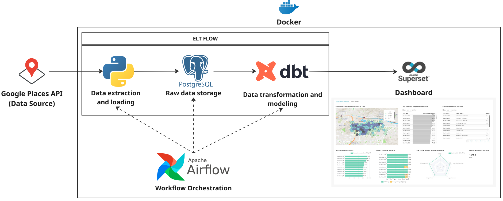
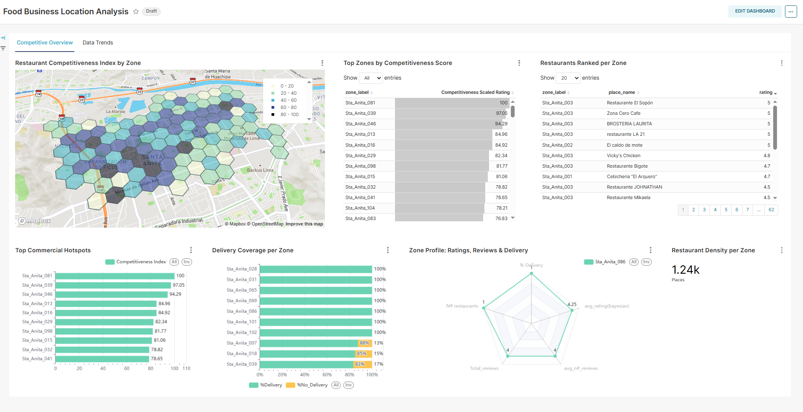
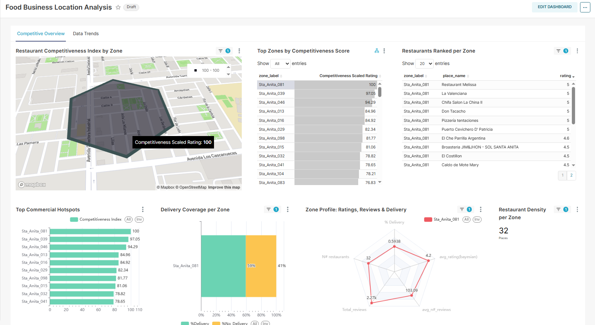
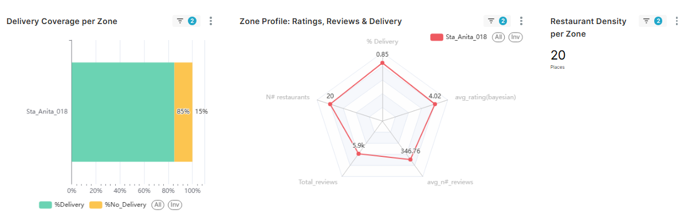

# Restaurant Analytics Pipeline

## Table of Contents
* [Overview](#overview)
* [Dataset Description](#dataset-description)
* [Technologies](#technologies)
* [Pipeline](#pipeline)
* [Data Modeling](#data-modeling)
* [Dashboard](#dashboard)
* [Getting Started](#getting-started)
* [Reference](#reference)
* [Additional Views](#additional-views)
## Overview
This project implements an end-to-end ELT pipeline to analyze restaurant market competitiveness using geospatial data.  
It extracts restaurant data from **Google Places API** for a selected area, stores it in **PostgreSQL**, transforms it with **dbt**, and visualizes insights with **Apache Superset**.  
The main goal is to identify **zones with high or low competitiveness** based on adjusted ratings, popularity, density, and delivery penetration — enabling market opportunity analysis and decision-making.

The pipeline is containerized with **Docker** and orchestrated by **Apache Airflow**, with modular components that can be adapted to any API or dataset matching the Google Places output format.

## Dataset Description
The dataset is generated dynamically via API calls. Each record contains:

| Column           | Description |
|------------------|-------------|
| id_location      | Unique place ID from Google Places API |
| latitude         | Latitude of the restaurant |
| longitude        | Longitude of the restaurant |
| rating           | Average user rating |
| userRatingCount  | Number of ratings received |
| place_name       | Name of the restaurant |
| hasDelivery      | Boolean flag for delivery availability |
| hex_id           | H3 hexagonal cell ID for spatial aggregation |
| inserted_at      | Timestamp of ingestion |

Additionally, a hexagon contour table stores the geospatial boundaries for visualization.

## Technologies
* **Python** (data extraction, API calls, database ingestion)
* **PostgreSQL** (raw and transformed data storage)
* **dbt** (data transformation & modeling)
* **Apache Airflow** (workflow orchestration)
* **Apache Superset** (dashboard & visualization)
* **Docker & Docker Compose** (containerization)
* **H3** (hexagonal spatial indexing)

## Pipeline


**Steps:**
1. **Data Extraction & Loading (Python)** – Calls Google Places API, converts coordinates into H3 hexagons, and inserts raw data into PostgreSQL.
2. **Raw Data Storage (PostgreSQL)** – Stores raw restaurant data and hexagon boundaries.
3. **Data Transformation (dbt)** – Cleans duplicates, applies Bayesian averaging for ratings, calculates KPIs (density, delivery share, popularity), and computes a competitiveness score.
4. **Visualization (Superset)** – Interactive dashboard to explore competitiveness by zone.
5. **Orchestration (Airflow)** – Manages extraction and transformation DAGs.

## Data Modeling
The dbt transformations produce:
- **`stg_*` tables** – Cleaned and deduplicated raw data.
- **`bayes_metrics`** – Ratings adjusted with Bayesian averaging.
- **`hex_kpis`** – Aggregated metrics by hexagon.
- **`restaurants_competitiveness`** – Final competitiveness score with scaled values for visualization.

## Dashboard


**Main features:**
- **Competitiveness Index Map** – Hexagonal heatmap of competitiveness scores.
- **Top Commercial Hotspots** – Ranking of most competitive zones.
- **Delivery Coverage** – Delivery penetration per zone.
- **Zone Profile** – Ratings, reviews, and delivery rates in radar chart.
- **Restaurant Density** – Number of places per zone.


## Getting Started
1. Clone this repository:
```bash
git clone https://github.com/yourusername/restaurant-analytics-pipeline.git
cd restaurant-analytics-pipeline
```
2. Copy and edit environment files:
Superset:
```bash
cp docker/.env_example docker/.env
```
Set SUPERSET_SECRET_KEY, MAPBOX_API_KEY, and DB vars if needed.
3. Set your Google Places API key in api_call/api_request.py (or adapt the code to read it from an env var). Do not commit real keys.
4. Define your area of interest (polygon) by editing the coordinates in api_call/data_insert.py → generate_hex_ids(). The pipeline will generate H3 hexagons from that polygon.
5. Build the dbt image used by the Airflow DockerOperator:
```bash
docker build -t [Your_User]/dbt-project:latest ./dbt
```
6. Start the stack:
```bash
docker compose up --build
```
7. Wait for superset-init to finish. Then access:
Airflow at http://localhost:8002 (the admin credentials are printed in container logs by airflow standalone; create a user if needed).
Superset at http://localhost:8088 (use the admin user created by the init script; update password immediately).
8. In Airflow, enable and trigger the DAG map-restaurants-orchestrator. It will:
- ingest API data → PostgreSQL
- run dbt transformations via the dbt Docker image
Optionally, trigger map-dbt-run to re-run only dbt when testing models.
9. Open Superset and explore the dashboard “Food Business Location Analysis”. If map tiles don’t render, verify MAPBOX_API_KEY in docker/.env.
Resetting the environment:
```bash
docker compose down -v
```
Removes containers and named volumes. If you mounted a local folder (e.g., ./postgres/data), delete that folder manually to fully reset the DB.
## Reference:
Google Places API: https://developers.google.com/maps/documentation/places/web-service/overview
dbt: https://docs.getdbt.com
Apache Superset: https://superset.apache.org
H3: https://h3geo.org
## Additional Views

**Zone Analysis Overview**  
Detailed breakdown of a selected zone showing competitiveness index, top ranked restaurants, delivery coverage, zone profile radar chart, and restaurant density.  


**Delivery & Profile Insights**  
Focused view of delivery penetration and profile metrics (ratings, reviews, density) for a specific zone.  


